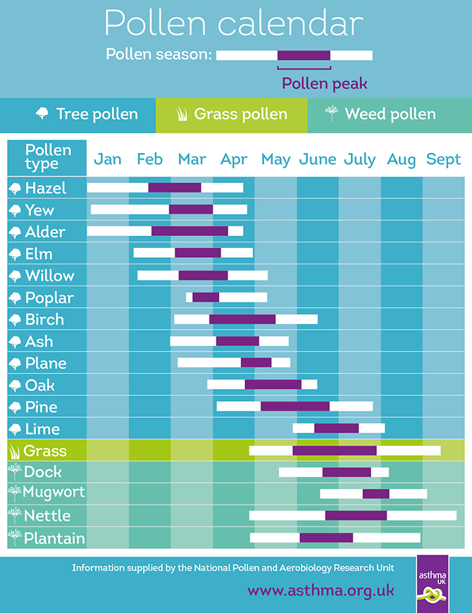

gtrendsR tutorial for beginners
================
Charlotte Woolley
9th of November 2017

The purpose of this tutorial is to give a brief introduction to Google Trends data using the gtrendsR package and to demonstrate some of its potential applications.

**Introduction to Google Trends**
---------------------------------

### What is Google Trends?

Google Trends is a freely available and publically accessible online facility of Google Inc. that provides pre-processed search query data from January the 1st 2004 until present day. The Google Trends [website](https://trends.google.co.uk/trends/) provides data and regularly updated trending themes/topics.

### Why is internet search query data important?

In recent times, the internet has become an essential source of information in many parts of the world. Over 50% of the world's population now has internet access and in Western countries such as the UK, internet usage has reached 88% of the population (Office for National Statistics, 2016). Clearly, the internet isn't getting any less important and will no doubt be relied on increasingly for a plethora of information. Indeed, increased reliance on the internet has led to the emergence of a type of research which falls under the term ‘infodemiology” coined by Eysenbach (2002), which essentially involves the study of the internet to reveal the distribution and determinants of health information, with the aim of improving public health.

### What can internet search query data be used for?

Many professionals, such as scientists, journalists, marketers, business and finance specialists, politicians and health care workers have realised the potential of using internet search queries as a source of useful information. Google Trends has been used for a wide range of scientific research, including:

-   General health, e.g Multiple sclerosis (Moccia *et al*., 2016)
-   Infectious disease, e.g Zika (Dimitrov *et al*., 2016)
-   Mental health, e.g Depression (Yang *et al*., 2010; 2011)
-   Veterinary health, e.g Tick paralysis in cats and dogs (Guernier *et al*., 2016)
-   Financial, e.g Quantifying trading behaviour (Preis *et al*., 2013)
-   Marketing, e.g Car sales (Carrière-Swallow & Labbé, 2013)
-   Political, eg. Predicting elections (Granka, 2013)

### What exactly is Google Trends data?

Google Trends data is not a huge dataset containing every search made by every IP address in the world. To ensure that it is practical and ethical to use the information obtained from search queries, Google pre-processes the data before it is released, so that it is:

-   Normalised; it is an ‘index’ of the proportion of queries within a particular geographical region at a particular time divided by the total number of queries at that region and time, where the maximum number of queries is scaled at 100
-   Anonymised; an unreported privacy threshold is kept so that if the total number of searches for a particular time and region are less than this value, a zero will be reported
-   Aggregated; for a time series of up to 4 hours - data is supplied for every minute, 24 hours - every 8 mins, 7 days - every hour, 3 months - every day, 5 years - every week, more than 5 years - every month
-   Cached daily; the same request on the same date will return the same data
-   Rounded to the nearest integer
-   Categorised into about 25 main categories and hundreds of subcategories
-   De-duplicated so that the same person making several of the same requests will not influence the results
-   De-symbolised so that all special characters are filtered out of the search term

(Google, 2017; Milinovich *et al*., 2014; Stephens-Davidowitz & Varian, 2015)

### Related terms and topics

In addition to providing temporal and locational data, Google also provides information of the top and rising 'related queries' and 'related topics'

-   Related queries (sometimes referred to as terms) are matches within your query in the same language. For example, if your search term is 'coconut', results will include 'coconut milk'. If your search term is 'coconut milk' results will include 'coconut oil' and 'pasteurised milk'
-   Related topics are a group of terms that have a similar concept and do not have to be in the same language. For example, if your search term is 'Scotland', results will include 'Schottland' (German for Scotland) and 'United Kingdom' (related topic)
-   Top refers to the most frequent and rising refers to the most growth in volume.

(Google, 2017)

### Understanding potential biases in Google Trends data

Despite the fact it is an undeniably useful tool, Google Trends data is not an ultimately superior source of information and contains its own individual biases that must be considered, like all data. Some important things to consider include:

-   The effect of the media; Google Trends data was positively correlated with the number of Ebola cases during the outbreak, but it was prone to distortion due to lack of digital access in developing countries and differences in media coverage (Alicino *et al*., 2015)
-   Unanticipated changes in search algorithm dynamics over time; shifts in linguistics, culture, technological changes and other unforeseen factors can influence search algorithms
-   The population of internet users; the internet was initially more available to those in academic institutions and/or populated areas and now has much broader use by the wider population
-   Search query selection; there are many possible terms that could be selected and ambiguity of search terms can cause interpretation errors if there is more than one meaning or spelling for a word
-   Don't be deceived by big data hubris (the assumption that big data substitute rather than compliment traditional data sources); the more sources of data you have, the more reliable your models will be!
-   Lack of data supplied by Google Trends; sometimes there will not be enough data from a particular region to bypass Google's anonymity threshold, which can cause certain regions to appear disproportionately uninterested in a particular search query
-   Interference from Google suggestions; when people are searching, they might change their natural searching behaviour based on Google search suggestions or spelling corrections
-   Changes in the Google data collection system; Google improved their data collection system on the 01/01/2016 and improved their geographical assignment on the 01/01/2011
-   Functionality of the gtrendsR package; it is not currently (although this is likely to be updated) possible to search England, Scotland, Wales and Northern Ireland seperately as regions, even though counties (e.g. Derbyshire) can be selected individually

(Nuti *et al*., 2014; Stephens-Davidowitz & Varian, 2015; Google, 2017)

**Installing and understanding the gtrendsR package**
-----------------------------------------------------

First if all, install the gtrendsR package (Massicotte & Eddelbuettel, 2016).

``` r
install.packages('gtrendsR')
```

Load gtrendsR and any other useful packages for this tutorial.

``` r
library(gtrendsR)
library(ggplot2)
library(ggmap)
library(lubridate)
library(dplyr)
```

The gtrendsR package is mainly built around the 'gtrends' function. This function contains the same arguments as can be specified for retrieving data on the Google Trends website. It is important to understand what these mean so I recommend checking out the help file (using ?gtrends). In order to know which codes to enter into the gtrends function for location and category, you need to extract these out of the package and view them. Locations are divided into countries and regions and categories are similarly divided into major catgories and subcategories.

``` r
data("countries")
head(countries)
```

    ##   country_code           description sub_code
    ## 1           AD              .ANDORRA         
    ## 2           AD                 Escas    AD-04
    ## 3           AE .UNITED ARAB EMIRATES         
    ## 4           AE             Abu Dhabi    AE-AZ
    ## 5           AE Ahmed Bin Rashid Port    AE-AZ
    ## 6           AE           Al Fujayrah    AE-FU

``` r
head(subset(countries, countries$country_code =='GB'), 15)
```

    ##       country_code          description sub_code
    ## 43433           GB      .UNITED KINGDOM         
    ## 43434           GB           Abbeystead   GB-LAN
    ## 43435           GB       Abbots Bromley   GB-STS
    ## 43436           GB       Abbots Langley   GB-HRT
    ## 43437           GB        Abbots Morton   GB-WOR
    ## 43438           GB           Abbotsbury   GB-DOR
    ## 43439           GB            Abbotsley   GB-CAM
    ## 43440           GB Aber Soch (Abersoch)   GB-GWN
    ## 43441           GB            Aberaeron   GB-CGN
    ## 43442           GB          Aberbargoed   GB-CAY
    ## 43443           GB           Abercanaid   GB-MTY
    ## 43444           GB             Abercarn   GB-CAY
    ## 43445           GB           Abercastle   GB-PEM
    ## 43446           GB             Abercraf   GB-POW
    ## 43447           GB             Abercych   GB-PEM

``` r
data("categories")
head(categories)
```

    ##                               name   id
    ## 1                   All categories    0
    ## 3             Arts & Entertainment    3
    ## 5 Celebrities & Entertainment News  184
    ## 6               Comics & Animation  316
    ## 8                   Animated Films 1104
    ## 9                    Anime & Manga  317

**Using Google Trends to explore temporal and geographical patterns in search query data**
------------------------------------------------------------------------------------------

### Example 1 - Investigate UK searches for 'hangover cure' over the past week

Use the gtrends function with the appropriate arguements.

``` r
hangover_cure <- gtrends(keyword = 'hangover cure', geo = 'GB', time = 'now 7-d')
```

The function produces an object that is a list of 6 dataframes. Dataframes are 'NULL' if Google Trends cannot produce enough data to bypass the Google confidentiality rules.

``` r
summary(hangover_cure)  
```

    ##                    Length Class      Mode
    ## interest_over_time 6      data.frame list
    ## interest_by_region 5      data.frame list
    ## interest_by_dma    0      -none-     NULL
    ## interest_by_city   0      -none-     NULL
    ## related_topics     6      data.frame list
    ## related_queries    6      data.frame list

To take an initial look at the data over the course of the week, the data does not need to be extracted from the list.

``` r
plot(hangover_cure)
```


However, this is not the 'prettiest' graph and it would be interesting to view the results summarised by day. To do this, the 'interest over time' dataframe needs to be extracted from the gtrends object.

``` r
hangover_cure_iot <- as.data.frame(hangover_cure$interest_over_time)
```

Then we need some code to group the date into days of the week and sort the levels so that ggplot will understand how to represent it...

``` r
hangover_cure_iot <- hangover_cure_iot %>%
mutate(date = as.Date(date),
        day = factor(lubridate::wday(ymd(date), label = TRUE),
        levels = c('Mon', 'Tue', 'Wed', 'Thu', 'Fri', 'Sat', 'Sun')))
```

We can then produce a boxplot of the data summarised for each day with ggplot.

``` r
ggplot(hangover_cure_iot, aes(x = day, y = hits, group = day)) +
        geom_boxplot() +
        stat_summary(fun.y=mean, colour="red", geom="point", shape=18, size=3.5) +
        labs(title = "Google searches in Great Britain for 'hangover cure' over the past week", 
             x = "Day", 
             y = "Search ratio") +
theme_bw()
```


It would also be interesting to look at which region within the UK searches for 'hangover cure' the most. To do this, the 'interest by region' dataframe needs to be extracted.

``` r
hangover_cure_ibr <- as.data.frame(hangover_cure$interest_by_region)
```

Then we can sort the levels of the regions in order of the largest search ratio and make a bar graph of the data using ggplot.

``` r
hangover_cure_ibr$location <- factor(hangover_cure_ibr$location, 
levels = hangover_cure_ibr$location[order(
hangover_cure_ibr$hits, decreasing = TRUE)])
ggplot(hangover_cure_ibr, aes(x=location, y = hits)) +
        geom_bar(stat='identity', fill = c('blue','red', 'gold', 'green')) +
        labs(title = "Google searches in Great Britain for 'hangover cure' over the last week", 
             x = "Region", 
             y = "Search index") +
        scale_y_continuous(breaks=c(seq(from=0, to=100, by=10))) +
theme_bw()
```


### Example 2 - Investigate UK searches for the term 'emigrate' over the last 5 years

Use the gtrends function with the appropriate arguements and view the summary.

``` r
emigrate <- gtrends(keyword = 'emigrate', geo = 'GB', time = 'today+5-y')
summary(emigrate)
```

    ##                    Length Class      Mode
    ## interest_over_time 6      data.frame list
    ## interest_by_region 5      data.frame list
    ## interest_by_dma    0      -none-     NULL
    ## interest_by_city   5      data.frame list
    ## related_topics     6      data.frame list
    ## related_queries    6      data.frame list

This time, only one of these dataframes is classed as 'NULL' which means there is a lot more data to explore. Therefore, we can start by extracting all the dataframes from the gtrends object.

``` r
emigrate_iot <- as.data.frame(emigrate$interest_over_time)
emigrate_ibr <- as.data.frame(emigrate$interest_by_region)
emigrate_ibc <- as.data.frame(emigrate$interest_by_city)
emigrate_rt <- as.data.frame(emigrate$related_topics)
emigrate_rq <- as.data.frame(emigrate$related_queries)
```

To view the data over time we can plot a line graph in ggplot

``` r
emigrate_iot$date <- as.Date(emigrate_iot$date)
ggplot(emigrate_iot, aes(x=date, y = hits)) +
        geom_line() +
        labs(title = "Google searches in Great Britain for 'emigrate' over the last 5 years", 
             x = "Year", 
             y = "Search index") +
        scale_y_continuous(breaks=c(seq(from=0, to=100, by=10))) +
        scale_x_date(date_breaks="1 year", date_labels = "%Y") +
theme_bw()
```


It is interesting to notice the peak in searches around the same time as Brexit happened! We can investigate whether searches for 'emigrate' have changed overall since Brexit by dividing the data into before and after the week commencing with the referendum (the referendum was held on the 23rd of June 2016 so week commencing with the referendum was the 18th of June 2016)

``` r
emigrate_iot$time_period <- factor(ifelse(emigrate_iot$date < "2016-06-18", 'Before Brexit', 'After Brexit'), 
                                levels = c('Before Brexit', 'After Brexit'))
ggplot(emigrate_iot, aes(x = time_period, y = hits, group = time_period)) +
        geom_boxplot() +
        stat_summary(fun.y=mean, colour="red", geom="point", shape=18, size=3.5) +
        labs(title = "Google searches in the UK for 'emigrate' before and after Brexit", 
             x = "Time Period (In the last 5 years)", 
             y = "Search ratio") +
        theme_bw()
```


We can also have a look at which regions have searched proportionally more for the term 'emigrate' over the last 5 years.

``` r
emigrate_ibr$location <- factor(emigrate_ibr$location, 
                                levels = emigrate_ibr$location[order(emigrate_ibr$hits, decreasing = TRUE)])
ggplot(emigrate_ibr, aes(x=location, y = hits)) +
        geom_bar(stat='identity', fill = c('blue','green', 'red', 'gold')) +
        labs(title = "Google searches in the UK for 'emigrate' over the last 5 years", 
             x = "Region", 
             y = "Search index") +
        scale_y_continuous(breaks=c(seq(from=0, to=100, by=10))) +
        theme_bw()
```


To narrow this down even further, we can look at the top 20 cities that searched the most for 'emigrate'.

``` r
emigrate_ibc$location <- factor(emigrate_ibc$location, 
                                levels = emigrate_ibc$location[order(emigrate_ibc$hits, decreasing = TRUE)])
ggplot(emigrate_ibc, aes(x=location, y = hits)) +
        geom_bar(stat='identity') +
        labs(title = "Google searches in the UK for 'emigrate' over the last 5 years", 
             x = "City", 
             y = "Search index") +
        scale_y_continuous(breaks=c(seq(from=0, to=100, by=10))) +
        theme_bw() +
        theme(axis.text.x=element_text(angle=90,hjust=1))
```


Interestingly, the results include 'Nazeing' as a city, which is actually a village in Essex, with a population of ~4500 people [(see wikipedia)](https://en.wikipedia.org/wiki/Nazeing). Seemingly, there was enough data in this relatively small area to bypass Google's confidentiality clause.

We can also have a look at the related queries and topics to 'emigrate'. In this tutorial I am going to focus on the top (or most frequent) related queries/topics but it is important to note that it is also possible to view the rising (or most rapidly increasing) related queries/topics.

``` r
top_queries <- subset(emigrate_rq, emigrate_rq$related_queries == 'top')
top_queries$subject <- as.numeric(top_queries$subject)
top_queries$value <- factor(top_queries$value, 
                        levels = top_queries$value[order(top_queries$subject, decreasing = TRUE)])
ggplot(top_queries, aes(x=value, y = subject)) +
        geom_bar(stat='identity') +
        labs(title = "Top related Google queries to 'emigrate' in the UK over the last 5 years", 
             x = "Related queries", 
             y = "Search index") +
        scale_y_continuous(breaks=c(seq(from=0, to=100, by=10))) +
        theme_bw() +
        theme(axis.text.x=element_text(angle=90,hjust=1))
```


``` r
top_topics <- subset(emigrate_rt, emigrate_rt$related_topics == 'top' & subject > 0)
top_topics$subject <- as.numeric(top_topics$subject)
top_topics$value <- factor(top_topics$value, 
                        levels = top_topics$value[order(
top_topics$subject, decreasing = TRUE)])
ggplot(top_topics, aes(x=value, y = subject)) +
        geom_bar(stat='identity') +
        labs(title = "Top related Google topics to 'emigrate' in the UK over the last 5 years", 
             x = "Related topics", 
             y = "Search index") +
        scale_y_continuous(breaks=c(seq(from=0, to=100, by=10))) +
        theme_bw() +
        theme(axis.text.x=element_text(angle=90,hjust=1))
```


### Example 3 - Investigate searches for 'hay fever' in the UK since Google Trends began

Use the gtrends function with the appropriate arguements and view the summary.

``` r
hay_fever <- gtrends(keyword = 'hay fever', geo = 'GB', time = 'all')
summary(hay_fever)
```

    ##                    Length Class      Mode
    ## interest_over_time 6      data.frame list
    ## interest_by_region 5      data.frame list
    ## interest_by_dma    0      -none-     NULL
    ## interest_by_city   5      data.frame list
    ## related_topics     6      data.frame list
    ## related_queries    6      data.frame list

Now we can extract the 'interest over time' database and plot it using ggplot

``` r
hay_fever_iot <- as.data.frame(hay_fever$interest_over_time)
hay_fever_iot$date <- as.Date(hay_fever_iot$date)
ggplot(hay_fever_iot, aes(x=date, y = hits)) +
        geom_line() +
        labs(title = "Google searches in Great Britain for 'hay fever' since 2004", 
             x = "Year", 
             y = "Search index") +
        scale_y_continuous(breaks=c(seq(from=0, to=100, by=10))) +
        scale_x_date(date_breaks="1 year", date_labels = "%Y") +
        theme_bw() +
        theme(axis.text.x=element_text(angle=90,hjust=1))
```


There is clearly a seasonal pattern to searching for 'hay fever'. To view this pattern more clearly, we can group the data by month and summarise it as a boxplot.

``` r
hay_fever_iot <- hay_fever_iot %>%
        mutate(month = lubridate::month(ymd(date), label = TRUE, abbr = FALSE))
ggplot(hay_fever_iot, aes(x = month, y = hits, group = month)) +
        geom_boxplot() +
        stat_summary(fun.y=mean, colour="red", geom="point", shape=18, size=3.5) +
        labs(title = "Google searches in Great Britain for 'hay fever' by month", 
             x = "Month", 
             y = "Hits") +
        theme_bw() +
        theme(axis.text.x=element_text(angle=90,hjust=1))
```


Interestingly, this pattern is remarkarbly comparable to published data on pollen counts in the UK:



Graphic from <https://www.asthma.org.uk/advice/triggers/pollen/>

### Example 4 - Investigate interest in 'fake news' in different countries

Use the gtrends function with the appropriate arguements and view the summary.

``` r
fake_news <- gtrends(keyword = 'fake news', time = 'all')
summary(fake_news)
```

    ##                    Length Class      Mode
    ## interest_over_time 6      data.frame list
    ## interest_by_region 5      data.frame list
    ## interest_by_dma    5      data.frame list
    ## interest_by_city   5      data.frame list
    ## related_topics     5      data.frame list
    ## related_queries    5      data.frame list

Now we can extract the 'interest over time' database and plot it using ggplot

``` r
fake_news_iot <- as.data.frame(fake_news$interest_over_time)
ggplot(fake_news_iot, aes(x=date, y = hits)) +
        geom_line() +
        labs(title = "Worldwide Google searches for 'fake news' since 2004", 
             x = "Year", 
             y = "Search index") +
        scale_y_continuous(breaks=c(seq(from=0, to=100, by=10))) +
        scale_x_date(date_breaks="1 year", date_labels = "%Y") +
        theme_bw() +
        theme(axis.text.x=element_text(angle=90,hjust=1))
```


There is an obvious increase in interest in 'fake news' around the time of the 2017 US presedential election! Now to see which countries are most interested...

``` r
fake_news_ibr <- as.data.frame(fake_news$interest_by_region)
fake_news_ibr$location <- factor(fake_news_ibr$location, 
                                levels = fake_news_ibr$location[order(fake_news_ibr$hits, decreasing = TRUE)])
ggplot(fake_news_ibr, aes(x=location, y = hits)) +
        geom_bar(stat='identity') +
        labs(title = "Google searches for 'fake_news' worldwide", 
             x = "Region", 
             y = "Search index") +
        scale_y_continuous(breaks=c(seq(from=0, to=100, by=10))) +
        theme_bw() +
        theme(axis.text.x=element_text(angle=90,hjust=1))
```


Now, to view this data in a heat map of the world it is quite easy because the gtrendsR package already provides country names. However, a few of the country names between map data and gtrends data need changing for consistency (see below).

``` r
fake_news_ibr$region <- ifelse(fake_news_ibr$location == 'United States','USA', 
                                ifelse(fake_news_ibr$location == 'United Kingdom', 'UK', 
                                        ifelse(fake_news_ibr$location == 'Czechia', 'Czech Republic', 
                                                as.character(fake_news_ibr$location))))
```

Now we just need to extract worldwide map data from ggmap, categorise the search hits (I have used categories of 20) and plot the data using ggplot

``` r
new_map <- full_join(map_data("world"), fake_news_ibr)
new_map$search_index <- factor(ifelse(is.na(new_map$hits), 'no data', 
                                ifelse(new_map$hits < 20, '< 20', 
                                 ifelse(new_map$hits >= 20 & new_map$hits < 40, '20 - 39', 
                                  ifelse(new_map$hits >= 40 & new_map$hits < 60, '40 - 59', 
                                   ifelse(new_map$hits >= 60 & new_map$hits < 80, '60 - 79', 
                                    ifelse(new_map$hits >= 80, '> 80', new_map$hits)))))), 
                                        levels = c('> 80', '60 - 79', '40 - 59', '20 - 39', '< 20', 'no data'))
ggplot(new_map, aes(x=long, y=lat, group=group, fill=search_index)) + 
        geom_polygon(colour="black", show.legend = T) +
        scale_fill_manual(values= alpha(c("darkred", "orangered3", "orange2", 
                                          "yellow1", "khaki1", "grey50"), 0.5)) +
        labs(title = "Google searches for 'fake news' worldwide", 
             x = "Longitude", 
             y = "Latitude") +
        theme_bw()
```


This tutorial was intended to demonstrate some of the potential uses and applications of the gtrendsR package and give you the tools to perform basic data visualisations. There are many other applications of gtrendsR and this tutorial barely scratched the surface.

### Get Trending!

**References**
--------------

-   Carrière-Swallow, Y., Labbé, F. (2011). Nowcasting with Google Trends in an Emerging Market. Journal of forecasting, 32, 289-298.
-   Dimitrov, B. D. (2016). Nowcasting incidence of emergent zika virus infection and its outbreaks using Google Trends data: Examples from Brazil and Colombia. International Journal of Infectious Diseases, 53, 98.
-   Eysenbach, G. (2002). Infodemiology: the epidemiology of (mis)information. The American Journal of Medicine, 113(9), 763-765
-   Google. (2017). Google Trends Help. Retrieved January 10, 2017, from <https://support.google.com/trends/?hl=en#topic=6248052>
-   Granka, L. (2013). Using Online Search Traffic to Predict US Presidential Elections. PS: Political Science & Politics, 46(2), 271-279
-   Massicotte, P., Eddelbuettel, D. (2016). Package ‘gtrendsR’. Retrieved 30 March, 2017, from <https://cran.rproject.org/web/packages/gtrendsR/gtrendsR.pdf>
-   Milinovich, G. J., Avril, S. M., Clements, A. C., Brownstein, J. S., Tong, S., & Hu, W. (2014). Using internet search queries for infectious disease surveillance: screening diseases for suitability. BMC Infectious Diseases, 14, 690
-   Moccia, M., Palladino, R., Falco, A., Saccà, F., Lanzillo, R., & Brescia Morra, V. (2016). Google Trends: new evidence for seasonality of multiple sclerosis. Journal of Neurology, Neurosurgery, and Psychiatry, (1), jnnp-2016-313260.
-   Nuti, S. V., Wayda, B., Ranasinghe, I., Wang, S., Dreyer, R. P., Chen, S. I., & Murugiah, K. (2014). The use of google trends in health care research: A systematic review. PLoS ONE, 9(10).
-   Office for National Statistics. (2016). Internet users in the UK: 2016. Statistical Bulletin, 1–9. Retrieved 08 January, 2017, from <https://www.ons.gov.uk/businessindustryandtrade/itandinternetindustry/bulletins/internetusers/2016>
-   Preis, T., Moat, H. S., Stanley. H. E. (2013). Quantifying trading behavior in financial markets using Google Trends. Scientific Reports, 3, 1684
-   Stephens-Davidowitz, S., & Varian, H. (2015). A Hands-on Guide to Google Data. Google, Inc., 1–25. Retrieved January 10, 2017, from <http://people.ischool.berkeley.edu/~hal/Papers/2015/primer.pdf>
-   Yang, A. C., Huang, N. E., Peng, C. K., & Tsai, S. J. (2010). Do seasons have an influence on the incidence of depression? the use of an internet search engine query data as a proxy of human affect. PLoS ONE, 5(10), 1–7.
-   Yang, A. C., Tsai, S. J., Huang, N. E., & Peng, C. K. (2011). Association of Internet search trends with suicide death in Taipei City, Taiwan, 2004-2009. Journal of Affective Disorders, 132(1–2), 179–184.
